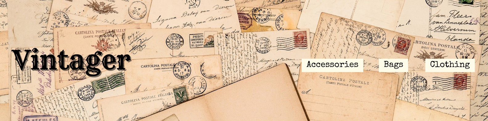

Website: [Vintager](https://vintager.onrender.com)

Vintager is a solo project that I used to learn Next.js and GraphQL. It is a vintage fashion blog that utilizes Hygraph for data storage and GraphQL for querying. To maintain quality content, visitor comments undergo admin approval before being displayed.

---

### Contributor

- [Siyun Feng](https://www.linkedin.com/in/siyunfeng)

### Technologies

- Next.js
- GraphQL
- Hygraph
- Sass
- Tailwind CSS
- Moment.js

### Data Source

- [Harlow Darling](https://harlowdarling.com)
- [Amy May](https://missamymay.com)
- [Kayla](http://www.gracefullyvintage.com.au)
